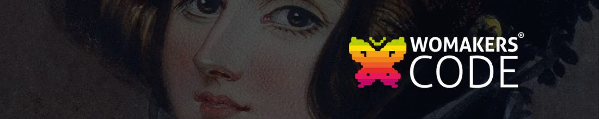

# Projeto 02 - POO e Banco de Dados com Python - Squad Rita Levi Montalcini

## Requisitos para executar

-   [Python](https://www.python.org/downloads/) Instalando e configurado
-   [DBeaver](https://dbeaver.io/) SGBD utilizado para conectar e manipular o Banco
-   [Visual Studio](https://code.visualstudio.com/download) IDE Para rodar ambiente de desenvolvimento com Python
   

  
## Como nos organizamos para este desafio:

1. Fizemos um primeiro encontro para escolhermos o tema, definir e dividir as Task's.
2. Participação de quase todas as integrantes.
3. Fizemos encontros frequentes para estudar e desenvolver o desafio juntas.
4. Fizemos a modelagem do tema escolhido: [Mercado](modelagem.md)
5. Todas que estavam presentes nas reuniões colaboraram nas atividades.
6. 
7. 
   
## Autores:

-    [Avilla Gabriella](https://github.com/avillagabriella)
-    [Ana Almeida](https://github.com/Ana-Almeida110)
-    [Beatriz Lima](https://github.com/beadlim)
-    [Karen Ribeiro](https://github.com/karenribeiro7)
-    [Melissa Gasque](https://github.com/MelissaGasque)
-    [Natália Marin](https://github.com/NaHaze)
-    [Yara Uchoa](https://github.com/YaraDanieleUchoa)

